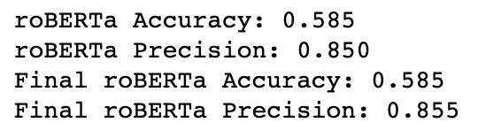

# Phase4NLP
Phase 4 Project

Authors: Leo Shell Villanueva, Rachael McCue, Gliglor Visalev, Russel Blanchard

This project is an academic exercise for Flatiron School's Data Science Phase 4 group project. From this point forward, we will treat this notebook as Data Scientists presenting to Apple Marketing Executives.

****************

We walk through our modeling process for natural language processing to predict sentiment analysis of tweets, and then for academic purposes we further explore deployment of Meta's roBERTa TweetEval model. Enjoy!

## Business Background
Days after the 2011 SXSW festival, we were tasked with analyzing the buzz generated by Apple's iPad 2 launch and general presence at the festival. Read more about SXSW [here](https://www.sxsw.com/about/).

In order to better understand the sentiment toward Apple and our products on Twitter, we set out to build a machine learning model that could be used to quickly analyze tweets and assign a sentiment.

## Data Understanding
The original data was slightly over 9,000 tweets from March 2011 during SXSW. From CrowdFlower, "Contributors evaluated tweets about multiple brands and products. The crowd was asked if the tweet expressed positive, negative, or no emotion towards a brand and/or product. If some emotion was expressed they were also asked to say which brand or product was the target of that emotion."

We focused primarily on tweets that pertained directly to Apple and our offerings.

The dataset contains 3 columns:

* tweet: anonymized tweets containing truncated hyperlinks
* directed: a label indicating whether the tweet contains a sentiment towards a product or company in particular
  * Apple
  * Apple products
  * Google
  * Android
  * None
* emotion: an assigned label indicating the sentiment of the tweet
  * Positive
  * Neutral
  * Negative
  * Cant tell

On March 11th, the same day as the iPad 2 launch, there was a catostrophic earthquake in Japan. We considered this in our approach to data cleaning as it was common behavior to form a tweet about the crisis simultaneously hashtaging #sxsw or #ipad.

### Data Limitations

There were over 5000 missing values in the directed column. We were able to address this by imputing as many missing values as possible. The data set was also heavily imbalanced: overwhelmingly neutral with very few examples of negative sentiment.

## Data Exploration

This pie chart shows the distribution of the sentiment of the tweets.

To further analyze, this is the distributuion per product or the brand. The Apple held an iPad launch at SXSW, so this chart appears accurate based on that information.

## Preprocessing

This section outlines our preprocessing to prepare for modeling. We located frequent words to remove that are irelevant to the sentiment of the tweet (consider @mention, rt, link, sxsw).

The preprocessing function takes in a document or tweet and does the following:

* Tokenize with RegExp
* Removes stopwords
* Gets the parts of speech for the lemmatizer
* Lemmatizes
* Removes the words from frequent word.

The preprocessing function returns the cleaned joined tweet.

## Baseline Model - Decision Tree Classifier

Our baseline model is a decision tree with a max depth of 3 to have a stopping criteria. The words in the word cloud stood out at influencing words from the decision tree.

We realized we still had some cleaning to remove words that don't offer any sentiment. The baseline model scored 58% precision score which is not perfect, this is a good baseline to jump off of. It was great to see that the model was not overfit to the train set with accuracy at around 55-56% for both train and test.

## Tuned Decision Tree

We tidied up extra words to remove- such as "'amp', 'via', 'android', 'app', 'apps', 'apple', 'iphone', 'pop', 'store', 'photo', 'open.'" We elevated the baseline model using a Grid Search method to find the best parameters for the Decision Tree. 

We did see an improvement in this model by 7%! Precision was 63% and accuracy was around 60%. Another example of the decision tree not overfitting. The predictions look slightly more distributed as well and less focused on neutral tweets.

## Support Vector Machine Classifier

We used support vector machine classifier to help with the imbalance of the data. Some scores here did the best yet, however we wont use this model as its most prone to overfitting. The train score was 77% which was great to see but the test score was 56%. Precision score did about as well as our baseline at 57%.

## Model Comparison

Our best performing model is the tuned decision tree. Given the size of the dataset, we wouldn't expect an extremely high score but we did see improvement in our models. The use of precision is to focus on reducing false positives.

### Next Steps
At present, we are very hesitant to base any future analysis on model that is only trained on 5000 tweets.

Should we choose to continue to invest in developing this model, we will need to collect vast amounts of data and explore data augmentation to produce more data in the minority class (negative tweets.) Data augmentation can be done in various ways, one interesting method is translating an English statement to Non-English, then back to English to get the same meaning but slightly different words.

However, we do need fast, reliable temperature checks available to our social media team in order to analyze twitter buzz in real time. For this reason, we have chosen to explore NLP models that are available to us.

## roBERTa TweetEval

[roBERTa](https://ai.facebook.com/blog/roberta-an-optimized-method-for-pretraining-self-supervised-nlp-systems/) is an NLP model developed by Meta's AI Team and introduced to the AI community in 2019. It expands on Google's BERT, pretrained on 3.3 Billion words ([Muller, 2022](https://huggingface.co/blog/bert-101)).

One of the most useful functions of roBERTa is that it can predict sentiment in a tweet. First, we deployed the model on our original dataset using roBERTa's suggested minimal preprocessing. Next, we wondered if we could take our exploration a step further and preprocess the data a bit more to improve the results.

You can find a complete account of this exploration in roBERTa.ipynb located in this repository. Below we've distilled the results for readability as the roBERTa model does require a more advanced computational environment to run.

We are very excited by roBERTa's performance, particularly in the vast improvement in precision scores. We find that when looking at the results, roBERTa's functionality does better account for the variety of sentiments represented in the dataset. It also scored better with tweets that contained more nuanced language like dry humor and sarcasm. We are also very optimistiv that the model's assessment of sentiment contains less bias.

## Conclusion and Looking Ahead

In conclusion, we are very pleased with the buzz generated by these last few weeks at SXSW.

Using roBERTa we will continue to expand beyond Twitter and look at other social platforms like Reddit, Pinterest, Facebook, Tumblr, Instagram, YouTube. There is so much data available and Machine Learning affords us the ability to analyze as much as possiblel in very little time.
